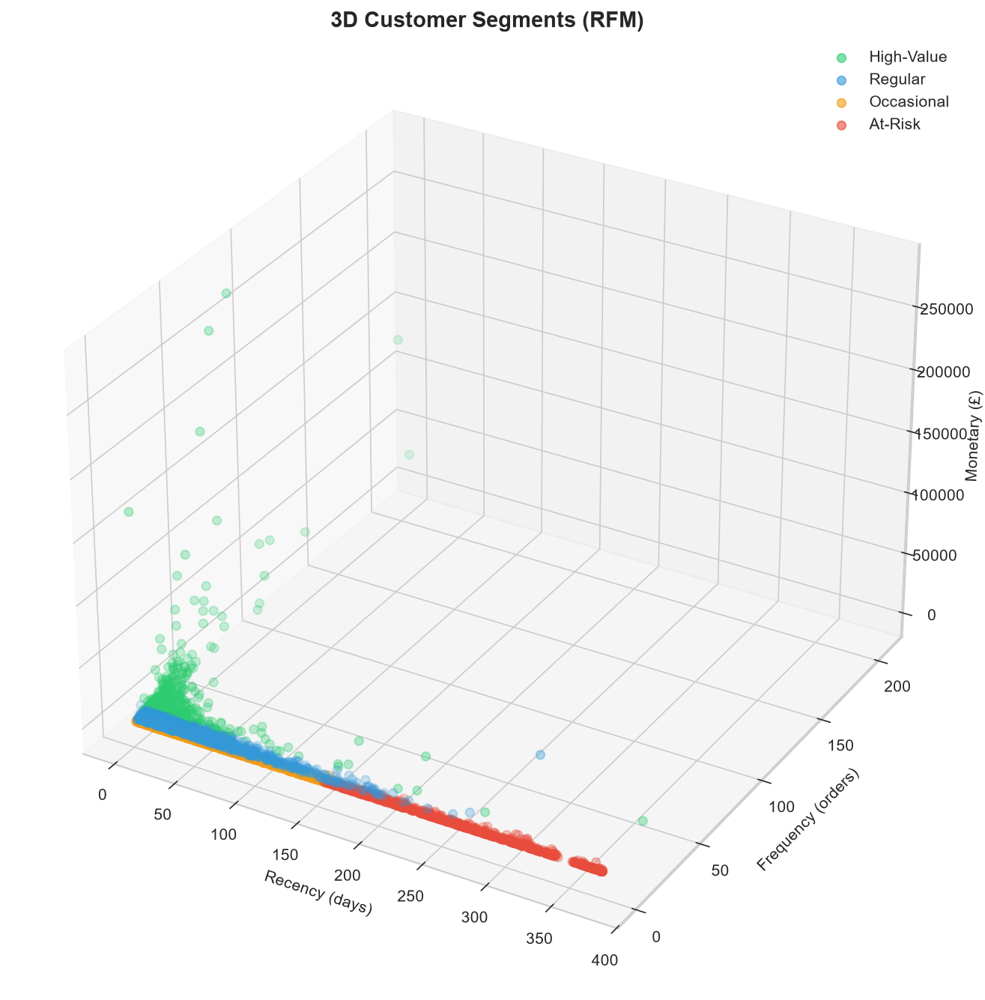

# 🛒 Shopper Spectrum: Customer Segmentation & Product Recommendation in E-Commerce


> **Customer Segmentation and Product Recommendation in E-Commerce** using RFM Analysis, KMeans Clustering, and Item-Based Collaborative Filtering.

---

## 📋 Table of Contents

- [Problem Statement](#problem-statement)
- [Business Objective](#business-objective)
- [Dataset](#dataset)
- [Project Structure](#project-structure)
- [Installation](#installation)
- [Usage](#usage)
- [Methodology](#methodology)
- [Results](#results)
- [Tech Stack](#tech-stack)
- [Screenshots](#screenshots)
- [Author](#author)

---

## 📣 Problem Statement

The global e-commerce industry generates vast amounts of transaction data daily, offering valuable insights into customer purchasing behaviors. This project examines transaction data from an online retail business to uncover patterns in customer purchase behavior, **segment customers** based on **Recency, Frequency, and Monetary (RFM) analysis**, and develop a **product recommendation system** using collaborative filtering techniques.

### Real-time Business Use Cases
- Customer Segmentation for Targeted Marketing Campaigns
- Personalized Product Recommendations on E-Commerce Platforms
- Identifying At-Risk Customers for Retention Programs
- Dynamic Pricing Strategies Based on Purchase Behavior
- Inventory Management and Stock Optimization

---

## 🎯 Business Objective

The company wants to:
- Understand its customers and find valuable customers
- Increase sales through personalized product recommendations
- Improve customer experience and reduce customer loss
- Make smart marketing decisions based on data

---

## 📊 Dataset

**Source:** Online Retail Transaction Dataset (Dec 2022 – Dec 2023)

| Column | Description |
|--------|-------------|
| `InvoiceNo` | Transaction number |
| `StockCode` | Unique product/item code |
| `Description` | Name of the product |
| `Quantity` | Number of products purchased |
| `InvoiceDate` | Date and time of transaction |
| `UnitPrice` | Price per product |
| `CustomerID` | Unique identifier for each customer |
| `Country` | Country where the customer is based |

**Raw Data:** 541,909 rows | **Cleaned Data:** 391,150 rows

---

## 🗂️ Project Structure

```
shopper_spectrum/
│
├── 📁 data/
│   ├── online_retail.csv              # Raw dataset
│   └── online_retail_cleaned.csv      # Cleaned dataset (Step 2 output)
│
├── 📁 notebooks/
│   └── shopper_spectrum.ipynb         # Complete analysis notebook (Steps 1-6)
│
├── 📁 models/                         # Saved ML models for Streamlit
│   ├── kmeans_model.pkl               # Trained KMeans clustering model
│   ├── scaler.pkl                     # StandardScaler for RFM normalization
│   ├── product_similarity.pkl         # Item-item cosine similarity matrix
│   └── product_names.pkl            # List of all product names
│
├── 📁 app/
│   └── app.py                         # Streamlit web application
│
├── 📁 outputs/
│   ├── eda_charts/                    # 19 EDA & clustering visualizations
│   │   ├── 01_country_revenue.png
│   │   ├── 03_top_products_quantity.png
│   │   ├── 05_monthly_revenue_trend.png
│   │   ├── 13_rfm_distributions.png
│   │   ├── 15_elbow_curve.png
│   │   ├── 17_cluster_profiles.png
│   │   ├── 18_3d_clusters.png
│   │   └── 19_product_similarity_heatmap.png
│   │   └── ... (and more)
│   ├── country_sales_summary.csv
│   ├── product_summary.csv
│   ├── monthly_sales_summary.csv
│   ├── customer_stats_summary.csv
│   ├── rfm_table.csv                  # Customer RFM scores
│   ├── cluster_profiles.csv           # Segment statistics
│   ├── segment_mapping.csv            # Cluster → Segment labels
│   └── product_list.txt
│
├── 📄 README.md                       # This file
├── 📄 requirements.txt                # Python dependencies
└── 📄 verify_setup.py                 # Environment verification script
```

---

## 🚀 Installation

### 1. Clone the Repository
```bash
git clone https://github.com/yourusername/shopper-spectrum.git
cd shopper-spectrum
```

### 2. Create Virtual Environment
```bash
python -m venv venv
```

### 3. Activate Virtual Environment
**Windows:**
```bash
venv\Scripts\activate
```
**macOS/Linux:**
```bash
source venv/bin/activate
```

### 4. Install Dependencies
```bash
pip install -r requirements.txt
```

---

## 🎮 Usage

### Option A: Run the Jupyter Notebook
```bash
jupyter notebook notebooks/shopper_spectrum.ipynb
```
Run all cells sequentially to execute the complete analysis pipeline (Steps 1–6).

### Option B: Run the Streamlit App
```bash
streamlit run app/app.py
```
Open your browser at `http://localhost:8501`

#### App Features:
- **🔍 Product Recommender:** Enter a product name → get 5 similar product recommendations
- **👤 Customer Segmentation:** Enter Recency, Frequency, Monetary values → predict customer segment

---

## 🧠 Methodology

### Step 1: Environment Setup
- Create project folder structure
- Install required packages: `pandas`, `numpy`, `matplotlib`, `seaborn`, `scikit-learn`, `streamlit`, `joblib`

### Step 2: Data Preprocessing
| Rule | Action | Rows Removed |
|------|--------|--------------|
| Missing CustomerID | Drop rows | 135,080 |
| Cancelled invoices (C*) | Exclude | 8,905 |
| Negative/zero Quantity | Filter out | Already removed |
| Negative/zero UnitPrice | Filter out | 40 |
| Non-product StockCodes | Filter out | 1,547 |
| Blank Description | Drop rows | 0 |
| Duplicates | Remove | 5,187 |
| **Total** | | **150,759 (27.82%)** |

### Step 3: Exploratory Data Analysis (EDA)
- Country-wise sales analysis
- Top-selling products by quantity and revenue
- Monthly and daily sales trends
- Customer lifetime value distribution
- Transaction value patterns
- Day-of-week and hour-of-day shopping patterns

### Step 4: RFM Analysis & Customer Segmentation
1. **Recency** = Latest date − Customer's last purchase date
2. **Frequency** = Number of unique transactions per customer
3. **Monetary** = Total amount spent by customer
4. Log-transform skewed features (Frequency, Monetary)
5. Standardize using `StandardScaler`
6. **Elbow Method** + **Silhouette Score** → optimal k = 4
7. **KMeans Clustering** (k=4, random_state=42)
8. **Auto-label clusters:**

| Segment | Characteristics | Strategy |
|---------|-----------------|----------|
| 🟢 **High-Value** | Low Recency, High Frequency, High Monetary | Loyalty rewards, VIP treatment |
| 🔵 **Regular** | Medium Frequency, Medium Monetary | Upsell & cross-sell campaigns |
| 🟡 **Occasional** | Low Frequency, Low Monetary, High Recency | Engagement & discount offers |
| 🔴 **At-Risk** | High Recency, Low Frequency, Low Monetary | Win-back campaigns, surveys |

### Step 5: Product Recommendation System
- **Approach:** Item-Based Collaborative Filtering
- **Method:** Cosine Similarity on CustomerID × Description purchase matrix
- **Output:** Top 5 similar products for any given product

### Step 6: Streamlit Application
- Interactive web app with 2 modules
- Product recommendation with fuzzy matching
- Real-time customer segment prediction

---

## 📈 Results

### Key Insights
- **UK dominates** with ~82% of total revenue
- **Top product:** WHITE HANGING HEART T-LIGHT HOLDER (highest quantity sold)
- **Peak sales:** November–December (holiday season)
- **Customer segments:** High-Value (most profitable), Regular (stable base), Occasional (growth opportunity), At-Risk (needs attention)

### Model Performance
- **KMeans (k=4):** Optimal clusters confirmed by Elbow Method and Silhouette Score
- **Cosine Similarity:** Captures purchase pattern similarity between products effectively

---

## 🛠 Tech Stack

| Category | Tools |
|----------|-------|
| **Language** | Python 3.11 |
| **Data Processing** | Pandas, NumPy |
| **Visualization** | Matplotlib, Seaborn |
| **Machine Learning** | Scikit-learn (KMeans, StandardScaler, Silhouette Score, Cosine Similarity) |
| **Web App** | Streamlit |
| **Model Persistence** | Joblib |
| **Notebook** | Jupyter Notebook |

**Tags:** `Pandas`, `NumPy`, `DataCleaning`, `FeatureEngineering`, `EDA`, `RFMAnalysis`, `CustomerSegmentation`, `KMeansClustering`, `CollaborativeFiltering`, `CosineSimilarity`, `ProductRecommendation`, `ScikitLearn`, `StandardScaler`, `StreamlitApp`, `MachineLearning`, `DataVisualization`

---

## 📸 Screenshots

> *Add screenshots of your Streamlit app and key visualizations here*

### Streamlit App — Product Recommender


### Streamlit App — Customer Segmentation


### RFM 3D Cluster Visualization


---

## 📌 Project Deliverables

- ✅ Python Notebook with clean, well-documented code and visualizations
- ✅ RFM-based customer segmentation and product similarity analysis
- ✅ Model evaluations (inertia, silhouette score)
- ✅ Streamlit Web Application with interactive UI
- ✅ Saved models for real-time prediction
- ✅ Comprehensive README documentation

---

## ⏳ Timeline

Project completed within **8 days** from assignment date.

---

## 👤 Author

**Your Name**
- GitHub: [@yourusername](https://github.com/yourusername)
- LinkedIn: [Your LinkedIn](https://linkedin.com/in/yourprofile)

---

## 📄 License

This project is licensed under the MIT License.

---

<p align="center">
  <b>🛒 Shopper Spectrum — Customer Segmentation & Product Recommendation</b><br>
  <i>Built with Python, Scikit-learn, and Streamlit</i>
</p>
